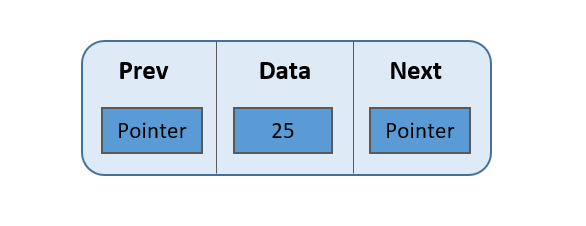

# DoubleLinkedList

> Uma lista duplamente ligada (DLL) contém um ponteiro extra, geralmente chamado de ponteiro anterior, junto com o próximo ponteiro e os dados que estão na lista vinculada individualmente.



## Estrutura

```go
type DoubleLinkedList struct {
	head   *Node
	tail   *Node
	length int
}

type Node struct {
	value int
	next  *Node
	prev  *Node
}
```

## Observações

- **Vantagens**:
  - Pode ser percorrida nas direções para frente e para trás. 
  - A operação de exclusão na DLL é mais eficiente se for fornecido um ponteiro para o nó a ser excluído.
  - Podemos inserir rapidamente um novo nó antes de um determinado nó.
  - Na DLL, podemos obter o nó anterior facilmente utilizando o ponteiro anterior. 
- **Desvantagens**:
  - Cada nó da DLL requer espaço extra para um ponteiro anterior. 
  - Todas as operações requerem um ajuste de ponteiro extra para serem mantidas.
