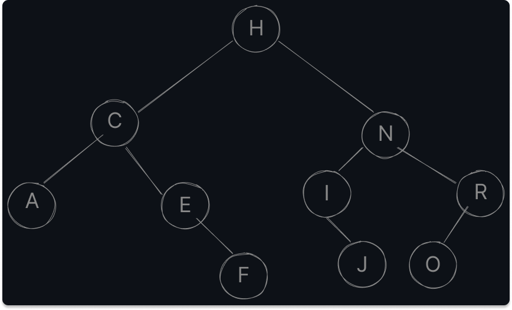

# Exercícios sobre Àrvores

<p align="center">
  <b>Universidade Federal do Rio Grande do Norte (UFRN)</b> <br/>
  <b>Centro de Tecnologia - Departamento de Engenharia de Computação e Automação (DCA)</b>
</p>

- **Disciplina:** Algoritmos e Estruturas de Dados I (EDI)
- **Professor:** Eduardo de Lucena Falcão

---

1. **Responda às seguintes perguntas:**
    - **a. Qual a diferença entre uma árvore binária e uma árvore de busca binária (BST)?**
      > **R:** Uma árvore binária é uma estrutura em que cada nó pode possuir, no máximo, dois filhos. Já uma árvore de busca binária é um tipo especial de árvore binária em que, para cada nó, todos os nós na subárvore esquerda deve ser menor que ele e todos os nós na subárvore direita devem ser maiores.

    - **b. O que significam os níveis de uma árvore?**
      > **R:** Os níveis de uma árvore referem-se à profundidade dos nós em relação à raiz da árvore. Cada nível indica a distância entre um nó e a raiz, sendo a raiz o nível 0 e os nós abaixo os níveis incrementados em 1.

    - **c. O que é uma BST completa?**
      > **R:** Basicamente podemos dizer que uma BST completa é uma BST comum, que respeita todas as regras de uma BST, porém TODOS os níveis possui filhos completos (o da direita e da esquerda) com exeção à regra o ultimo nível. Ou seja é uma árvore binária em que todos os níveis estão preenchidos com exatamente dois nós exceto, possivelmente, o último nível.

    - **d. Como calculamos o fator de balanceamento de uma árvore?**
      > **R:** O fator de balanceamento de uma árvore é calculado subtraindo a altura da subárvore direita pela altura da subárvore esquerda. Sendo a altura de uma subárvore a distância máxima entre o nó raiz e qualquer folha naquela subárvore. Ou seja, `Fator de balanceamento = altura(subárvore direita) - altura(subárvore esquerda)`.
    
    - **e. Qual a altura de uma árvore balanceada contendo n nós? Mostre matematicamente.**
    > **R:** Em uma árvore binária balanceada contendo "`n`" nós, a altura da árvore é calculada como o logaritmo na base 2 de `n`. Matematicamente, a altura da árvore é dada por: `altura = log2(n)`

    - **f. Qual a complexidade de tempo das seguintes operações em uma árvore completamente desbalanceada?**

    <table align="center">
      <thead>
      <tr>
      <th align="left"><strong>Operação</strong></th>
      <th align="left"><strong>Complexidade</strong></th>
      </tr>
      </thead>
      <tbody><tr>
      <td align="left"><code>Add(value int)</code></td>
      <td align="left">O(n)</td>
      </tr>
      <tr>
      <td align="left"><code>Search(value int) bool</code></td>
      <td align="left">O(n)</td>
      </tr>
      <tr>
      <td align="left"><code>Min() int</code></td>
      <td align="left">O(n)</td>
      </tr>
      <tr>
      <td align="left"><code>Max() int</code></td>
      <td align="left">O(n)</td>
      </tr>
      <tr>
      <td align="left"><code>PrintPre()</code></td>
      <td align="left">O(n)</td>
      </tr>
      <tr>
      <td align="left"><code>PrintIn()</code></td>
      <td align="left">O(n)</td>
      </tr>
      <tr>
      <td align="left"><code>PrintPos()</code></td>
      <td align="left">O(n)</td>
      </tr>
      <tr>
      <td align="left"><code>Height() int</code></td>
      <td align="left">O(n)</td>
      </tr>
      <tr>
      <td align="left"><code>Remove(value int) *BstNode</code></td>
      <td align="left">O(n)</td>
      </tr>
      </tbody>
    </table>

    - **g. Qual a complexidade de tempo das seguintes operações em uma árvore completa?**

      > **R:** Para uma àrvore comple complexidade de tempo das operações `Add`, `Search`, `Min`, `Max` e `Remove` em uma árvore completa é `log(n)`, onde "`n`" é o número de nós na árvore. Isso ocorre porque em uma árvore completa, a altura da árvore é logarítmica em relação ao número de nós. Já as operações de impressão `PrintPre`, `PrintIn` e `PrintPos` possuem uma complexidade de tempo de `O(n)`, pois precisam percorrer todos os nós da árvore para imprimir seu conteúdo. A operação `Height` em uma árvore completa também possui complexidade de tempo `O(n)`, pois a altura da árvore é sempre a proporcional ao número de nós (log(n + 1) - 1) e é preciso percorre-la até o nó folha mais fundo (da esquerda ou direita) para pegar sua altura.

      <table align="center">
        <thead>
        <tr>
        <th align="left"><strong>Operação</strong></th>
        <th align="left"><strong>Complexidade (BST completa)</strong></th>
        <th align="left"><strong>Complexidade (apenas completa)</strong></th>
        </tr>
        </thead>
        <tbody><tr>
        <td align="left"><code>Add(value int)</code></td>
        <td align="left">O(log(n))</td>
        <td align="left">O(n)</td>
        </tr>
        <tr>
        <td align="left"><code>Search(value int) bool</code></td>
        <td align="left">O(log(n))</td>
        <td align="left">O(n)</td>
        </tr>
        <tr>
        <td align="left"><code>Min() int</code></td>
        <td align="left">O(log(n))</td>
        <td align="left">O(n)</td>
        </tr>
        <tr>
        <td align="left"><code>Max() int</code></td>
        <td align="left">O(log(n))</td>
        <td align="left">O(n)</td>
        </tr>
        <tr>
        <td align="left"><code>PrintPre()</code></td>
        <td align="left">O(n)</td>
        <td align="left">O(n)</td>
        </tr>
        <tr>
        <td align="left"><code>PrintIn()</code></td>
        <td align="left">O(n)</td>
        <td align="left">O(n)</td>
        </tr>
        <tr>
        <td align="left"><code>PrintPos()</code></td>
        <td align="left">O(n)</td>
        <td align="left">O(n)</td>
        </tr>
        <tr>
        <td align="left"><code>Height() int</code></td>
        <td align="left">O(n)</td>
        <td align="left">O(n)</td>
        </tr>
        <tr>
        <td align="left"><code>Remove(value int) *BstNode</code></td>
        <td align="left">O(log(n))</td>
        <td align="left">O(n)</td>
        </tr>
        </tbody>
      </table>

    - **h. Explique os possíveis casos de remoção em uma BST. Como deve-se proceder em cada caso?**
      > **R:** Quando encontramos o elemento que deseja ser removido precisamos, antes de remover, verificar em qual caso ele se encaixa. Os casos são: o nó desejado à remoção é um nó folha (não possui filhos), o nó que deseja remover possui **apenas** um filho (à esquerda ou direita) e, por ultimo, o nó desejado à remoção possui todos os dois filhos preenchidos. Após verificarmos qual caso estamos lidando, precisamos tomar as medidas necessárias respeitando cada condição. Se estamos no `primeiro caso`, que é o mais simples, apenas removemos o elemento pois, como se trata de um nó folha, sua remoção não afetará ninguem abaixo dele. Se estamos no `segundo caso`, precisamos substituir o nó que deseja remover pelo único filho existente. E, por ultimo, se estamos no `terceiro caso` podemos substituir o elemento a ser removido pelo maior elemento mais à partir dele.

2. **Programe uma Binary Search Tree na linguagem Go:**

  ```go
  type ITree interface {
    Add(value int)
    Search(value int) bool
    Min() int
    Max() int
    PrintPre()
    PrintIn()
    PrintPos()
    PrintLevels()
    Height() int
    Remove(value int) *BstNode
  }

  type BstNode struct {
    left *BstNode
    value int
    right *BstNode
  }

  ```

  Interface descrita em [tree.go](./tree.go) com métodos implementados em [binary_search_tree.go](./binary_search_tree.go).


3. **Considere uma Árvore de Busca Binária que foi criada através da inserção dos 10 primeiros caracteres do seu nome (sem repetição)**

```go
  ['E', 'R', 'N', 'A', 'F', 'I', 'O', 'C', 'H', 'J']
  // ordenado
  ['A', 'C', 'E', 'F', 'H', 'I', 'J', 'N', 'O', 'R']
```

Sendo assim:



a. **Qual seria a ordem de visitação/processamento ao aplicar uma navegação Pré-Ordem?**
  > **R:** Pré-ordem: Raíz -> Esquerda -> Direita => [H, C, A, E, F, N, I, J, R, O]

b. **Qual seria a ordem de visitação/processamento ao aplicar uma navegação Em-Ordem?**
  > **R:** Em-ordem: Esquerda -> Raíz -> Direita => [A, C, E, F, H, I, J, N, O, R]

C. **Qual seria a ordem de visitação/processamento ao aplicar uma navegação Pós-Ordem?**
  > **R:** Em-ordem: Esquerda -> Direita -> Raíz => [A, F, E, C, J, I, O, R, N, H]

D. **Qual seria a ordem de visitação/processamento ao aplicar uma navegação por níveis?**
  > **R:** Em-ordem: Esquerda -> Direita -> Raíz => [H, C, N, A, E, I, R, F, J, O]

4. Escreva uma função que identifica se uma árvore é uma BST.

  ```go
  type BstNode struct {
    left *BstNode
    value int
    right *BstNode
  }
  func (bstNode *BstNode) isBst() bool
  ```

  Implementação realizada em [binary_search_tree](./binary_search_tree.go)

5. Escreva uma função que retorna a quantidade de elementos de uma BST.

  ```go
  type BstNode struct {
    left *BstNode
    value int
    right *BstNode
  }
  func (bstNode *BstNode) Size() int
  ```

  Implementação realizada em [binary_search_tree](./binary_search_tree.go)

6.  Escreva uma função que recebe um vetor contendo elementos desordenados e retorna uma BST balanceada.

  ```go
  type BstNode struct {
    left *BstNode
    value int
    right *BstNode
  }
  func createBst(v []int) *BstNode
  ```

  Implementação realizada em [binary_search_tree](./binary_search_tree.go)
